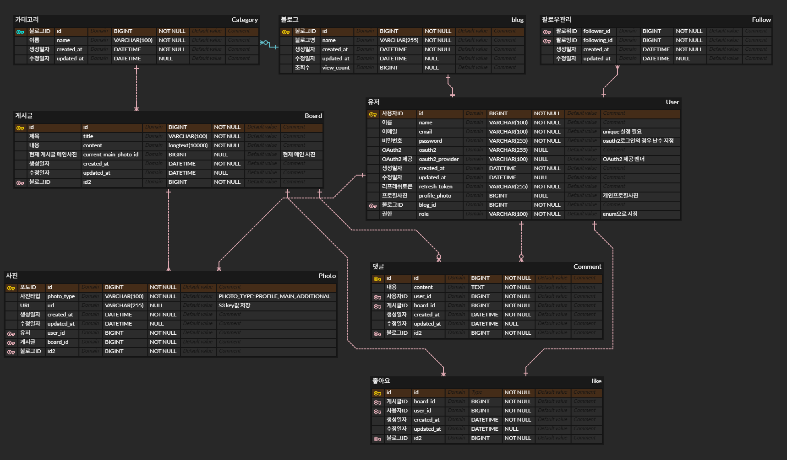

<div align="center">
  <h1>🌳모먼트리 (Momentree)🌳</h1> 
  
  
</div>
<br/>

<div>
  <div align="center">
    <h2>📷Moment(순간) + 🌳Tree(나무)</h2> 
  </div>
  <h4> 🌳개인 블로그 형태로 일상 / 사진을 정리할 수 있는 시스템 </h4>
  <h4> 🌳카테고리로 개인 일상 블로그 관리, 사진 모음집처럼 사진만 모아서 관리가 가능한 사진 블로그 </h4>
</div>


<br/>
<br/>

## 목차
1. 프로젝트 개요
2. 팀 소개
3. 프로젝트 주요 기능
4. 기획서, 정의서
5. ERD
6. 프로젝트에서 사용한 기술 스택들
7. 시스템 아키텍처
8. 프로젝트 구조
9. 실행 화면

<br/>
<br/>

# 1. Project Overview (프로젝트 개요)
- 프로젝트 이름: 모먼트리 (Momentree)
- 프로젝트 설명: 일상의 순간들이 모여 성장하는 나무처럼 쌓이는 공간

<br/>
<br/>

# 2. Team Members (팀원 및 팀 소개)
| 권태윤 | 노봉준 | 박혁 | 전병우 | 김동규 |
|:------:|:------:|:------:|:------:|:------:|
|  |  |  |  | 
| PL | BE/FE | BE/FE | BE/FE | BE/FE |
| [GitHub](https://github.com/Kwon-TaeYun) | [GitHub](https://github.com/pickipi) | [GitHub](https://github.com/Vincentius7) | [GitHub](https://github.com/ddoonge) | [GitHub](https://github.com/Morgan-EE) |
| [Blog](https://github.com/Kwon-TaeYun) | [Blog](https://lefton.tistory.com/) | [Blog](https://velog.io/@vincentius/posts) | [Blog]() | [Blog](https://mmatrix.tistory.com/) |

<br/>
<br/>

## 2-1. Tasks & Responsibilities (작업 및 역할 분담)
|  |  |  |
|-----------------|-----------------|-----------------|
| 권태윤    |   | <ul><li>프로젝트 계획 및 관리</li><li>팀 리딩 및 커뮤니케이션</li><li>커스텀훅 개발</li></ul>     |
| 노봉준   |  | <ul><li>메인 페이지 개발</li><li>동아리 만들기 페이지 개발</li><li>커스텀훅 개발</li></ul> |
| 박혁   |      |<ul><li>홈 페이지 개발</li><li>로그인 페이지 개발</li><li>동아리 찾기 페이지 개발</li><li>동아리 프로필 페이지 개발</li><li>커스텀훅 개발</li></ul>  |
| 전병우    |      | <ul><li>회원가입 페이지 개발</li><li>마이 프로필 페이지 개발</li><li>커스텀훅 개발</li></ul>    |
| 김동규    |      | <ul><li>회원가입 페이지 개발</li><li>마이 프로필 페이지 개발</li><li>커스텀훅 개발</li></ul>    |

<br/>
<br/>

# 3. Key Features (주요 기능)
- **회원 및 인증 관리**:
  - 일반 회원가입/ 로그인
    - 이메일, 비밀번호 등 기본정보를 통해 가입 및 로그인
    - DB에 유저정보 등록
  - 카카오 소셜 로그인 (OAuth2)
    - 별도의 회원가입 없이 카카오 계정으로 로그인
    - OAuth 2.0 기반으로 인증 및 사용자 정보 연동
  - 비밀번호 찾기
    - 이메일 인증을 통해 비밀번호 재설정
  - 마이페이지
    - 회원 정보 수정 및 회원 탈퇴
    
- **게시글 및 콘텐츠 관리**:
  - 게시글 CRUD
    - 게시글 작성, 수정, 삭제
    - 게시글 본문에 여러 장의 이미지를 첨부할 수 있고, 대표 이미지를 통해 썸네일 지정
    - 이미지는 AWS S3에 저장되며, 저장된 이미지의 URL을 반환
  - 게시글 카테고리
    - 기존 카테고리 선택 및 새로운 카테고리 생성
  - 게시글 검색
    - 키워드 기반으로 게시글을 검색
    - 최신순 정렬 및 10개 단위 페이징 처리

- **소셜 기능**:
  - 팔로우
    - 회원 간에 팔로우 및 언팔로우 가능
    - 팔로워/팔로잉 개수 확인 및 해당 사용자 목록 조회
    - 프로필 정보는 팝업 형태로 제공
  - 좋아요
    - 게시글에 좋아요를 누를 수 있고, 좋아요 개수 및 사용자 목록을 확인
  - 댓글 CRUD
    - 게시글에 댓글을 작성, 수정, 삭제

- **기타 기능**:
  - 이미지 관리
    - 게시글 및 프로필 등에 첨부된 이미지는 AWS S3에 저장되어 대용량 이미지 관리에 최적화
  - 통계 및 피드
    - 인기 블로그, 인기 콘텐츠, 최신 콘텐츠 등 통계 정보 제공

<br/>
<br/>

# 4. 기획서, 정의서

## 4.1 기획서
[기획서](https://docs.google.com/document/d/1yqykSqAJP7rT0gRzcH1ejz4d1ZKBfGOBhKH4VKb8skI/edit?usp=sharing)

## 4.2 정의서
[정의서](https://docs.google.com/spreadsheets/d/1FCHJoJ2tc7w20aNp11prWuBEmehtbjFN-n2wbCZb0Ok/edit?gid=0#gid=0)

<br/>
<br/>

# 5. ERD


<br/>
<br/>

# 6. Technology Stack (기술 스택)
## 6.1 Language
|  |  |
|-----------------|-----------------|
| HTML5    || 
| CSS3    |   |
| Javascript    |   | 

<br/>

## 6.2 Frotend
|  |  |  |
|-----------------|-----------------|-----------------|
| React    |   | 18.3.1    |
| StyledComponents    |  | 6.1.12   |
| MaterialUI    |      | 5.0.0  |
| DayJs    |      | 1.11.12    |

<br/>

## 6.3 Backend
|  |  |  |
|-----------------|-----------------|-----------------|
| Firebase    |      | 10.12.5    |

<br/>

## 6.4 Cooperation
|  |  |
|-----------------|-----------------|
| Git    |      |
| Git Kraken    |      |
| Notion    |      |

<br/>
<br/>

# 7. System Architecture (시스템 아키텍처)

<공란>

<br/>
<br/>

권태윤
gweontaeyun6909
오프라인 표시

권태윤 — 오전 10:02
저희 목차 정ㅇ해봐요....
노봉준 — 오전 10:03
생각중입니다
팀,팀원 소개 (작업 및 역할 분담 추가)
프로젝트 소개
주요기능
기획서, 정의서 (링크)
ERD (이미지)
사용한 기술 스택들 (기술 아이콘, 백엔드/프론트엔드 분리)
시스템 아키텍처 (이미지)
프로젝트 구조
실행 화면
이렇게 가죠
권태윤 — 오전 10:05
아키텍처랑기술스택 같이 넣어서
이미지
이미지
노봉준 — 오전 10:05
그 외로는 추가하고
권태윤 — 오전 10:05
아 오 정리 잘해주셨네
좋습니다
전병우 — 오전 10:07
https://github.com/likelion-project-README/README

실행화면은 이런식으로 가나요?
GitHub
GitHub - likelion-project-README/README: 멋쟁이사자처럼 프...
멋쟁이사자처럼 프론트엔드 스쿨 3기 oh-my-code팀 프로젝트. Contribute to likelion-project-README/README development by creating an account on GitHub.
GitHub - likelion-project-README/README: 멋쟁이사자처럼 프...
노봉준 — 오전 10:07
네 이렇게 GIF 형식이 깔끔할 것 같아요 이미지 여러개 ㅂ ㅗ다
보다
권태윤 — 오전 10:09
저런것도 넣을 수 있구나 ㅋㅋㅋㅋㅋ
이미지
목차 이렇게 수정했습니다
노봉준 — 오전 10:10
넵 각자

이부분에 쓰일 이미지랑 깃헙 링크 보내주세요
이미지
제가 1, 2번 만들겠습니다.
추가 링크도 할 수 있으면 넣어보겠습니다 (블로그, SNS)
권태윤 — 오전 10:10
일단 만들어보시면 역할은 제가 수정해볼게요.. 적고 싶은게 있어서
혹시 프로젝트 구조에는 어떤게 잇을까요??
노봉준 — 오전 10:11
이미지
저희 main 브랜치의 소스코드 프로젝트 구조를
만들면 될 것 같네요
상위 디렉토리까지만
권태윤 — 오전 10:12
일단 1~2 // 3 // 4~5 // 6~7 //8 ~ 9로 나누시죠..
봉준님 혹시 1~2 진행중이세요??
노봉준 — 오전 10:14
팀,팀원 소개 (작업 및 역할 분담 추가)
프로젝트 소개
주요기능
기획서, 정의서 (링크)
ERD (이미지)
사용한 기술 스택들 (기술 아이콘, 백엔드/프론트엔드 분리)
시스템 아키텍처 (이미지)
프로젝트 구조
실행 화면

➡️1~2번 제가 간단히 만들어보고 다른 부분 합류할게요.
➡️3번 : OOO 님
➡️4~5번 : 태윤님 - 아까 역할 관련해서 작성하실거 있으시다고 하셔서
➡️6~7번 : OOO 님
➡️8~9번 : OOO 님
네 1~2번 만드려고합니다
권태윤 — 오전 10:15
역할은 4~5가 아닌데 ㅋㅋㅋㅋ
노봉준 — 오전 10:15
저희 목차에 따르면 그럼
1~2번이 역할이네요
권태윤 — 오전 10:15
그냥 제가 마무리할때 수정할게요
노봉준 — 오전 10:16
알겠습니다 잠시 목차부터 수정할게요 순서 
저희 템플릿으로
전병우 — 오전 10:16
저는 그럼 6,7할게요
권태윤 — 오전 10:16
제가 그럼 8,9할게요
전병우 — 오전 10:16
아키텍처 만들면서 기술스텍 사진들 모아논게 있어서
박혁 — 오전 10:16
저는 3번
권태윤 — 오전 10:16
그럼 동규님 4~5번 해주세요
커밋할때 겹쳐서 내용 날라가거나 그러진 않겠죠? ㅋㅋㅋㅋ
노봉준 — 오전 10:17
넵 이렇게 진행하는걸로하죠 
그 readme커밋 진행중일땐 다른 분이 커밋변경안되는것같으니 작업내용 부분은 복사 자주 해놓으시면 될 것 같습니다.
권태윤 — 오전 10:17
넵 말씀 잘하셨습니다 ㅋㅋ 감사합니다
노봉준 — 오전 10:17
겹칠땐 아예 commit이 안올라가더라구요 그럴땐 복사해놓고 새로고침 후에 다시 진행하면 될 것 같습니다
권태윤 — 오전 10:17
넵넵
일단 저희 잠시 틀만 짜놓고
시작할까요?
그말씀이 봉준님 말씀이셨나
노봉준 — 오전 10:18
네 제가 그 큰 목차를 순서만 정리해놓을게요 저희 플젝에 맞게
권태윤 — 오전 10:18
하셨던 대로 이런것만 정리 부탁드립니다
이미지
제 사진 여깄어요 ㅋㅋㅋㅋ
https://github.com/Kwon-TaeYun
GitHub
Kwon-TaeYun - Overview
Kwon-TaeYun has 11 repositories available. Follow their code on GitHub.
이미지
깃 주소도 여기있습니다
이미지
이걸로 부탁드립니다 사진
노봉준 — 오전 10:21
알겠습니다
저희 수정된거없죠? 
지금 목차 수정된거
커밋할게요
권태윤 — 오전 10:21
넵넵
노봉준 — 오전 10:21
이 목차 순서대로 진행하시면 될 것 같습니다
권태윤 — 오전 10:22
아 지금된거죠??
노봉준 — 오전 10:22
넵 수정했습니다. 그 작업 및 역할 분담은 놔둘테니 나중에 태윤님이 수정해주세요
네 지금 되었습니다
권태윤 — 오전 10:22
넵넵
그래도 훨 편하다 마음이 ㅋㅋㅋㅋㅋ
저희 구조가 이렇게 시작하면 될까요?
이미지
root를 momentree_blog로
그 다음 backend, frontend 이렇게
노봉준 — 오전 10:25
네 backend, frontend가 나뉘는것만 잘보여도 괜찮을 것 같네요
권태윤 — 오전 10:25
github 디렉토리 기준으로 할게요...
이미지
이거 어떤 역할인지 아시는분?
노봉준 — 오전 10:30
프론트엔드 부분에서의 dependency 관리하는 거라 듣긴했었어요
권태윤 — 오전 10:30
그렇군요..감사합니다
노봉준 — 오전 10:40
네 그 부분은 빼도 될 것 같네요
혹시 지금 작업중이신분들계신가요?
권태윤 — 오전 10:42
저일단 계속 하고 있어요
노봉준 — 오전 10:42
아하 혁님이랑 병우님, 동규님도 사진이랑 깃헙, 블로그 링크 보내주시면 첨부해놓을게요
캐릭터 사진도 괜찮습니다
박혁 — 오전 10:55
https://velog.io/@vincentius/posts
이미지
vincentius (빈첸시오) / 작성글 - velog
vincentius님이 작성한 포스트 시리즈들을 확인해보세요.
이미지
노봉준 — 오전 10:55
확인했습니다 깃헙 주소는 저희 프로젝트했던거 참고해서 넣어놨어요
전병우 — 오전 11:02
저희 언어는 뭐뭐썻을까요?
사진은 나중에 보내드릴게요
박혁 — 오전 11:09
주요기능 작성해서 커밋했습니다. 내용 확인해보시고 추가할 기능 있으시면 말씀해주세요!
권태윤 — 오전 11:09
커밋이 됐어요?
ㅋㅋㅋㅋ
빠르시네요..
전 아직 백엔드쪽 구조 만들고 있는데 ㅋㅋㅋㅋ
노봉준 — 오전 11:12
저도 주요 핵심부분은 커밋해놨습니다
작업내용 있으셔서 커밋 안될때는 복사 -> 새로고침 -> 다시 복붙 해주시면 될 것 같아요
이미지
이미지
권태윤 — 오전 11:16
언제 다하지? ㅋㅋㅋㅋㅋ
이미지
김동규2 — 오전 11:37
4.기획서, 정의서 5.ERD 추가완료했습니다
전병우 — 오전 11:38
봉준님 로컬에 있는 사진은 어떻게 올리셨나요?
노봉준 — 오전 11:38
이미지 우클릭 복사하셔서 붙여넣기 하시면 깃허브 링크로 자동으로 올라갑니다!
김동규2 — 오전 11:39
아 복붙이 되는군요
전병우 — 오전 11:39
오
김동규2 — 오전 11:39
add files했는데 ㅋㅋ
전병우 — 오전 11:39
그럼 깃허브 사이트에서 하는 건가요?
노봉준 — 오전 11:39
네 여기 edit에서 그냥 복붙하시면 링크 자동으로 생성해줍니다
이미지
전병우 — 오전 11:40
아.. 그럼 사진 빼고 일단 작성하고 사진추가하면 되겠네요
감사합니다!
권태윤 — 오전 11:42
전 이제야 백엔드 구조 다햇네요
프론트는 점심먹고하고
인프라까지만 해놓겠습니다
# 8. Project Structure (프로젝트 구조)
```plaintext
momentree_blog/
├── .github/
│   ├── ISSUE_TEMPLATE           
│   |   ├── custom.md         # 이슈 작성 시 사용되는 템플릿
확장
message.txt
11KB

# 8. Project Structure (프로젝트 구조)
```plaintext
momentree_blog/
├── .github/
│   ├── ISSUE_TEMPLATE           
│   |   ├── custom.md         # 이슈 작성 시 사용되는 템플릿
│   └── workflows         
│       ├── deploy.yml        # 백엔드 CI/CD 시 사용되는 yml 파일
│       ├── gemini-code-review.yml  # PR 시 AI가 코드 점검해주는 yml 파일
|
├── backend/src/main/
│   ├── java/com/likelion/momentreeblog/              
│   |   ├── config        
│   |   |   ├── error         
│   |   |   |    └── GlobalExceptionError.java         # 전체적인 오류들을 한 곳에 모아둔 java 파일
│   |   |   ├── s3Config         
|   |   |   |    └── s3Config.java         # S3 사용 시 설정 정보들
│   |   |   ├── security       #시큐리티 관련 파일들
│   |   |   |    ├── dto
│   |   |   |    |    └── CustomUserDetails.java       
│   |   |   |    ├── exception
│   |   |   |    |    ├── CustomAuthenticationEntryPoint.java
│   |   |   |    |    └── jwtExceptionCode.java      
│   |   |   |    ├── token
│   |   |   |    |    └── jwtAuthenticationToken.java 
│   |   |   |    └── CustomAuthenticationFilter.java           
│   |   |   ├── securityConfig         # 시큐리티 사용 시 설정 정보들
│   |   |   └── swaggerConfig         # swagger api 사용 시 설정 정보들
│   |   ├── domain
│   |   |   ├── blog/blog      
│   |   |   |    ├── controller
│   |   |   |    |    └── BlogApiV1Controller.java
│   |   |   |    ├── dto
│   |   |   |    |    ├── BlogCreateRequestDto.java
│   |   |   |    |    ├── BlogDetailResponseDto.java
│   |   |   |    |    ├── BlogResponseDto.java
│   |   |   |    |    ├── BlogRequestDto.java
│   |   |   |    |    └── BlogUpdateRequestDto.java
│   |   |   |    ├── entity
│   |   |   |    |    └── Blog.java
│   |   |   |    ├── repository
│   |   |   |    |    └── BlogService.java
│   |   |   |    └── service
│   |   |   ├── board       
│   |   |   |    ├── board
│   |   |   |    |    ├── controller
│   |   |   |    |    |   └── BoardApiV1Controller.java
│   |   |   |    |    ├── dto
│   |   |   |    |    |   ├── BoardDetailResponseDto.java
│   |   |   |    |    |   ├── BoardListResponseDto.java
│   |   |   |    |    |   ├── BoardMyBlogResponseDto.java
│   |   |   |    |    |   ├── BoardRequestDto.java
│   |   |   |    |    |   └── BoardResponseDto.java
│   |   |   |    |    ├── entity
│   |   |   |    |    |   └── Board.java
│   |   |   |    |    ├── repository
│   |   |   |    |    |   └── BoardRepository.java
│   |   |   |    |    └── service
│   |   |   |    |        └── BoardService.java
│   |   |   |    ├── category
│   |   |   |    |    ├── controller
│   |   |   |    |    |   └── CategoryController.java
│   |   |   |    |    ├── dto
│   |   |   |    |    |   ├── CategoryCreateRequestDto.java
│   |   |   |    |    |   ├── CategoryResponseDto.java
│   |   |   |    |    |   └── CategoryUpdateRequestDto.java
│   |   |   |    |    ├── entity
│   |   |   |    |    |   └── Category.java
│   |   |   |    |    ├── repository
│   |   |   |    |    |   └── CategoryRepository.java
│   |   |   |    |    └── service
│   |   |   |    |        └── CategoryService.java
│   |   |   |    ├── comment
│   |   |   |    |    ├── dto
│   |   |   |    |    |   ├── CommentDto.java
│   |   |   |    |    |   └── CommentRequestDto.java
│   |   |   |    |    ├── entity
│   |   |   |    |    |   └── Comment.java
│   |   |   |    |    ├── repository
│   |   |   |    |    |   └── CommentRepository.java
│   |   |   |    |    └── service
│   |   |   |    |        └── CommentService.java
│   |   |   |    └── like
│   |   |   |         ├── dto
│   |   |   |         |   └── BoardLikeInfoDto.java
│   |   |   |         ├── entity
│   |   |   |         |   └── Like.java
│   |   |   |         ├── repository
│   |   |   |         |   └── LikeRepository.java
│   |   |   |         └── service
│   |   |   |             └── LikeService.java
│   |   |   ├── photo/photo       
│   |   |   |    ├── controller
│   |   |   |    |    ├── BoardPhotoApiV1Controller.java
│   |   |   |    |    └── ProfilePhotoApiV1Controller.java
│   |   |   |    ├── dto
│   |   |   |    |    ├── board
│   |   |   |    |    |   ├── BoardPhotoResponseDto.java
│   |   |   |    |    |   └── PhotoAlbumDto.java
│   |   |   |    |    └── photo
│   |   |   |    |        └── PhotoUploadResponseDto.java
│   |   |   |    ├── entity
│   |   |   |    |    └── Photo.java
│   |   |   |    ├── photoenum
│   |   |   |    |    └── PhotoType.java
│   |   |   |    ├── repository
│   |   |   |    |    └── PhotoRepository.java
│   |   |   |    └── service
│   |   |   |         └── PhotoService.java
│   |   |   ├── s3       
│   |   |   |    ├── controller
│   |   |   |    |    └── S3ApiV1Controller.java
│   |   |   |    ├── dto
│   |   |   |    |    ├── request
│   |   |   |    |    |   ├── PhotoUploadMultiRequestDto.java
│   |   |   |    |    |   └── PhotoUploadRequestDto.java
│   |   |   |    |    └── response
│   |   |   |    |        ├── PresignedUrlMutiResponseDto.java
│   |   |   |    |        └── PresignedUrlResponseDto.java
│   |   |   |    └── service
│   |   |   |         └── S3V1Service.java
│   |   |   └── user       
│   |   |        ├── follower/entity
│   |   |        |    └── FollowerManagement.java
│   |   |        ├── role/entity
│   |   |        |    └── Role.java
│   |   |        └── user
│   |   |             ├── controller
│   |   |             |   ├── FollowerApiV1Controller.java
│   |   |             |   ├── UserApiV1Controller.java
│   |   |             |   └── UserFindApiV1Controller.java
│   |   |             ├── dto
│   |   |             |   ├── UserDeleteRequest.java
│   |   |             |   ├── UserDto.java
│   |   |             |   ├── UserFollowerDto.java
│   |   |             |   ├── UserLikeDto.java
│   |   |             |   ├── UserLoginDto.java
│   |   |             |   ├── UserLoginResponseDto.java
│   |   |             |   ├── UserResponseDto.java
│   |   |             |   ├── UserSignupDto.java
│   |   |             |   └── UserUpdateDto.java
│   |   |             ├── entity
│   |   |             |   └── User.java
│   |   |             ├── repository
│   |   |             |   ├── FollowerRepository.java
│   |   |             |   ├── UserFindRepository.java
│   |   |             |   └── UserRepository.java
│   |   |             ├── service
│   |   |             |   ├── AuthTokenService.java
│   |   |             |   ├── FollowerService.java
│   |   |             |   ├── FollowerServiceImpl.java
│   |   |             |   ├── UserFindService.java
│   |   |             |   ├── UserFindServiceImpl.java
│   |   |             |   └── UserService.java
│   |   |             └── userenum
│   |   |                 └── UserService.java    
│   |   ├── global
│   |   |   ├── jpa
│   |   |   |   └── BaseEntity.java
│   |   |   ├── rq
│   |   |   |   └── Rq.java
│   |   |   ├── ut
│   |   |   |   └── Ut.java
│   |   |   ├── util
│   |   |   |   ├── jwt
│   |   |   |   |    └── JwtTokenizer.java
│   |   |   |   └── security
│   |   |   |        ├── CustomAuthorizationRequestResolver.java
│   |   |   |        ├── CustomOAuth2AuthenticationSuccessHandler.java
│   |   |   |        ├── CustomOAuth2UserService.java
│   |   |   |        └── SecurityUser.java
│   |   |   └── AppConfig.java    
│   |   ├── main/controller         # 이슈 작성 시 사용되는 템플릿
│   |   └── MomentreeblogApplication.java   # 이슈 작성 시 사용되는 템플릿
|   |
│   └── resources/          
│       ├── applicaion-dev.yml        # 개발 환경 시 사용되는 환경 설정 yml 파일
│       ├── application-prod.yml         # 배포 환경 시 사용되는 환경 설정 yml 파일
│       ├── application-test.yml         # 테스트 케이스 작성 시 사용되는 환경 설정 yml 파일
│       ├── application-secret.yml         # 공개하면 안되는 정보 작성 시 사용되는 환경 설정 yml 파일
│       └── application.yml         # 전체적으로 사용되는 환경 설정 yml 파일
|
│── frontend/    # 정확한 종속성 버전이 기록된 파일로, 일관된 빌드를 보장
│   ├── assets/              # 이미지, 폰트 등 정적 파일
│   ├── components/          # 재사용 가능한 UI 컴포넌트
│   ├── hooks/               # 커스텀 훅 모음
│   ├── pages/               # 각 페이지별 컴포넌트
│   ├── App.js               # 메인 애플리케이션 컴포넌트
│   ├── index.js             # 엔트리 포인트 파일
│   ├── index.css            # 전역 css 파일
│   ├── firebaseConfig.js    # firebase 인스턴스 초기화 파일
├── infra
│   ├── .gitignore             
│   ├── main.tf            
│   ├── secrets.tf            
│   └── variables.tf                 
├── README.md                # 팀 소개 및 프로젝트 소개
├── .gitignore               # github 커밋 및 push시 안넣는 파일들 , Git 무시 파일 목록
├── package-lock.json        
└── docker-compose.yml       # docker에서 프로젝트와 db를 연결시키기 위한 yml 파일
<br/>

```

<br/>
<br/>

# 9. 실행화면 예시

<공란>
